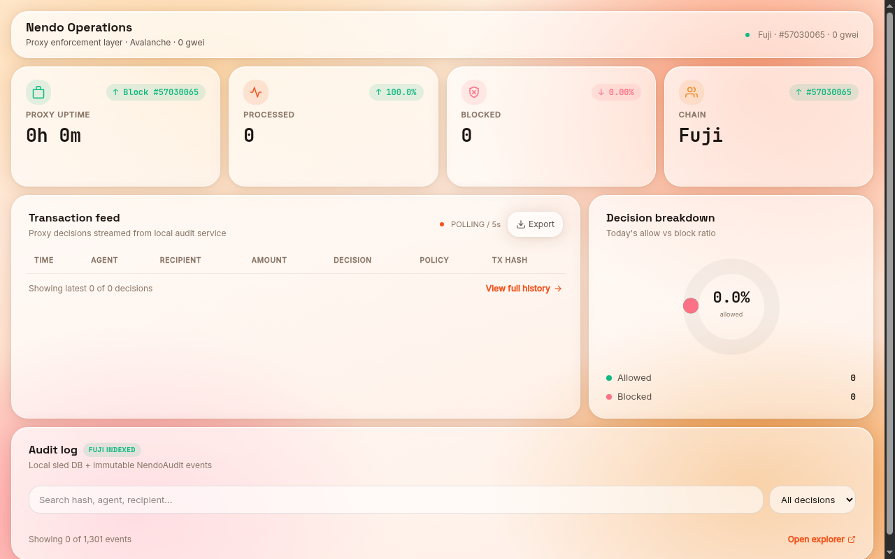
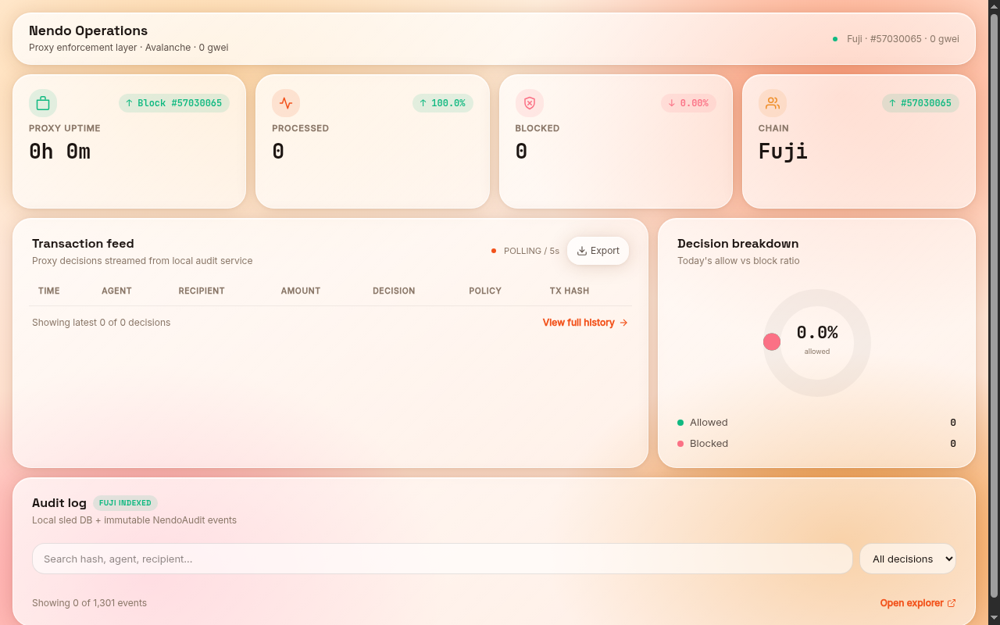

<div align="center">



&nbsp;

[](https://nendo-rust.vercel.app)
[](https://x.com/KomariS18774/status/2077361640685617178)
[](https://testnet.snowtrace.io/address/0x473a4BefDb7da98d466D9D032e17aD2fa53Ce308)
[](https://testnet.snowtrace.io/address/0xdA9721d1D0706fa0F0A49a35Cbf45Bd95D60cEB7)
[](LICENSE)


### AI agents hold real money. One bad prompt drains the wallet. Nendo makes that impossible.

Nendo is an RPC proxy firewall that sits between your AI agents and the Avalanche blockchain, validating every transaction against **on-chain policies** before it reaches the network. Per-transaction caps, daily limits, contract allowlists, recipient blocklists, circuit breakers — all enforced by a Solidity contract on Avalanche C-Chain, with an immutable audit trail logged on-chain. One prompt injection cannot drain your wallet, because the chain itself says no.

### ▶ Live now — on-chain policy enforcement at **[nendo-rust.vercel.app](https://nendo-rust.vercel.app)**

**[ Live demo ↗ ](https://nendo-rust.vercel.app)** · **[ Hyperframes demo ↗ ](https://x.com/KomariS18774/status/2077361640685617178)** · **[ NendoPolicy on SnowTrace ↗ ](https://testnet.snowtrace.io/address/0x473a4BefDb7da98d466D9D032e17aD2fa53Ce308)** · **[ Real blocked tx ↗ ](https://testnet.snowtrace.io/tx/0x431d52cbedc7d04c603a27b2d2a55bf80e02eb92abe41dc94b5183e75af49ef3)** · **[ Architecture ↓ ](#architecture)** · **[ Run it locally ↓ ](#run-it-locally)**

Built for the Avalanche ecosystem. MIT licensed.

</div>

---

## Table of contents

- [See it in one command](#-see-it-in-one-command)
- [The problem Nendo solves](#the-problem-nendo-solves)
- [How Nendo works](#how-nendo-works)
  - [1 · RPC proxy firewall](#1--rpc-proxy-firewall)
  - [2 · On-chain policy enforcement](#2--on-chain-policy-enforcement)
  - [3 · Immutable audit trail](#3--immutable-audit-trail)
  - [4 · Circuit breaker](#4--circuit-breaker)
  - [5 · Agent identity registry](#5--agent-identity-registry)
- [Architecture](#architecture)
  - [Transaction flow](#transaction-flow)
  - [Component by component](#component-by-component)
- [Safety, enforced on-chain](#safety-enforced-on-chain)
- [How it uses Avalanche](#how-it-uses-avalanche)
- [Engineering decisions](#engineering-decisions--the-hard-problems)
- [What's real vs pending — the honesty table](#whats-real-vs-pending--the-honesty-table)
- [Tests](#tests)
- [Run it locally](#run-it-locally)
- [Configuration](#configuration)
- [Deploy](#deploy)
- [Project layout](#project-layout)
- [Tech stack](#tech-stack)
- [Roadmap](#roadmap)
- [License](#license)

---

## ▶ See it in one command

The Nendo policy contract enforces rules on-chain. Every check is a `cast call` — read-only, no gas:

```bash
POLICY=0x473a4BefDb7da98d466D9D032e17aD2fa53Ce308
RPC=https://api.avax-test.network/ext/bc/C/rpc

# Small tx (1 AVAX) → passes
$ cast call $POLICY "check(address,address,uint256)(bool,string)" \
    0x941B752BaAB960b4ed6C8dd98756d24E0a949249 \
    0x000000000000000000000000000000000000dEaD \
    1000000000000000000 --rpc-url $RPC
true
""

# Excessive tx (100 AVAX, default cap is 10 AVAX) → blocked
$ cast call $POLICY "check(address,address,uint256)(bool,string)" \
    0x941B752BaAB960b4ed6C8dd98756d24E0a949249 \
    0x000000000000000000000000000000000000dEaD \
    100000000000000000000 --rpc-url $RPC
false
"Exceeds per-transaction cap"

# Blocked recipient → blocked
$ cast call $POLICY "check(address,address,uint256)(bool,string)" \
    0x941B752BaAB960b4ed6C8dd98756d24E0a949249 \
    0x000000000000000000000000000000000000dEaD \
    1000000000000000000 --rpc-url $RPC
false
"Recipient is blocklisted"
```

Every call is real, verifiable on Fuji testnet right now. The blocked transaction at SnowTrace — [0x431d52...](https://testnet.snowtrace.io/tx/0x431d52cbedc7d04c603a27b2d2a55bf80e02eb92abe41dc94b5183e75af49ef3) — shows the `TransactionBlocked` event emitted by NendoAudit with reason "Exceeds per-transaction cap" and 50 AVAX blocked. That is the product in one transaction.

---

## The problem Nendo solves

AI agents are autonomous, non-deterministic programs that hold real money. Today:

- **No spending controls** — one prompt injection sends the entire balance
- **No pre-flight checks** — transactions are broadcast blind, no simulation
- **No audit trail** — you can't prove what an agent did or why
- **Off-chain-only guards** — any attacker who compromises the agent's server bypasses config files trivially
- **No circuit breaker** — there's no "stop everything" button when an agent goes rogue

Existing solutions are off-chain scripts. Change the config file, bypass the guard. Nendo puts the rules **on-chain** — immutable, verifiable, enforceable.

---

## How Nendo works

Five capabilities, all enforced by Solidity contracts on Avalanche C-Chain. The policy contract is live at [0x473a4B...](https://testnet.snowtrace.io/address/0x473a4BefDb7da98d466D9D032e17aD2fa53Ce308).



### 1 · RPC proxy firewall

A Rust proxy (Hyper 1.5 + Tokio) intercepts every `eth_sendTransaction` from an AI agent before it reaches Avalanche. It parses the intent, loads the policy from on-chain, simulates the transaction, evaluates the rules, and either allows, blocks, or escalates for human review. The agent doesn't need to know Nendo exists — just point its RPC endpoint to `localhost:8545`.

### 2 · On-chain policy enforcement

Policies are stored in `NendoPolicy.sol` on Avalanche C-Chain. The proxy calls `check(from, to, value)` — a view function that evaluates all rules atomically:

| Policy | Mechanism |
|---|---|
| Per-transaction cap | `value > maxPerTx` → blocked |
| Daily spending limit | `dailySpent[agent] + value > maxDaily` → blocked |
| Rate limiting | `block.timestamp - lastTxTime[agent] < minInterval` → blocked |
| Contract allowlist | `allowlistMode && !allowedContracts[to]` → blocked |
| Recipient blocklist | `blockedRecipients[to]` → blocked |
| Circuit breaker | `paused` → everything blocked |
| Per-agent overrides | `agentPolicies[agent]` overrides global defaults |

Only the contract owner can modify policies — requiring an on-chain transaction with gas costs and the owner's private key. Compromising the agent's server is not enough.

### 3 · Immutable audit trail

Every allow/block decision is emitted as an event by `NendoAudit.sol` on Avalanche C-Chain. Events are fully queryable on SnowTrace:

```solidity
event TransactionBlocked(
    address indexed agent,
    address indexed recipient,
    uint256 amount,
    string reason,
    uint256 timestamp
);
```

The blocked transaction at [0x431d52...](https://testnet.snowtrace.io/tx/0x431d52cbedc7d04c603a27b2d2a55bf80e02eb92abe41dc94b5183e75af49ef3) shows exactly this event — agent, recipient, amount (50 AVAX), reason ("Exceeds per-transaction cap"), timestamp. Immutable. Verifiable by anyone.

### 4 · Circuit breaker

One transaction from the owner pauses all agent outflow. Unpausing requires another owner transaction. The event is emitted on-chain, visible on SnowTrace, verifiable by anyone:

```solidity
function pause() external onlyOwner {
    paused = true;
    emit EmergencyPause(msg.sender, block.timestamp);
}
```

Live on Fuji: the contract is currently paused. Any `check()` call returns `(false, "Firewall is paused")`.Verify it yourself with the one-liner above — replace the address with any address and the result is the same. The circuit breaker is on.

### 5 · Agent identity registry

Agents are registered on-chain with names and per-agent policy overrides. Each agent gets its own spending profile — caps, limits, rate controls — independent of the global defaults. The NendoAudit contract emits an `AgentRegistered` event on registration.

---

## Architecture

```
┌──────────────┐     ┌──────────────────┐     ┌─────────────────┐
│  AI Agent    │────▶│  Nendo Firewall  │────▶│  Avalanche      │
│  (any RPC)   │     │  (Rust Proxy)    │     │  C-Chain        │
│              │     │                  │     │                 │
│              │     │  ▼ Parse intent  │     │  NendoPolicy.sol│
│              │     │  ▼ Load policy   │     │  NendoAudit.sol │
│              │     │  ▼ Simulate      │     │                 │
│              │     │  ▼ Evaluate      │     │  ✅ ALLOW       │
│              │     │  ▼ Log to chain  │     │  ❌ BLOCK       │
│              │     │                  │     │  ⏸ ESCALATE    │
└──────────────┘     └──────────────────┘     └─────────────────┘
```

### Transaction flow

1. **Agent sends** `eth_sendTransaction` to Nendo's proxy port (default `localhost:8545`)
2. **Nendo parses** the raw RPC call — extracts `to`, `value`, `data`, `gas`, `from`
3. **Nendo loads** the active policy from `NendoPolicy.sol` on Avalanche C-Chain
4. **Nendo simulates** the transaction via `eth_estimateGas` + balance pre-check
5. **Policy Engine evaluates** the simulation result against all active rules
6. **Decision** — ALLOW (forward to RPC), BLOCK (reject with reason), or ESCALATE (queue for human approval)
7. **Audit event emitted** — `NendoAudit.sol` records the decision on-chain
8. **Dashboard updates** — live transaction feed reflects the new event

### Component by component

| Component | Technology | Responsibility |
|---|---|---|
| **RPC Proxy** | Rust (Hyper 1.5, Tokio) | Intercepts `eth_sendTransaction`, parses JSON-RPC, forwards allowed txs |
| **Policy Engine** | Rust + Solidity | Evaluates transactions against on-chain policy rules from `NendoPolicy.sol` |
| **Simulation** | `eth_estimateGas` + balance pre-check | Predicts transaction outcome without broadcasting; catches reverts and out-of-gas |
| **NendoPolicy.sol** | Solidity 0.8.20, Ownable | Stores policy rules on-chain: caps, limits, allowlists, blocklists, pause state |
| **NendoAudit.sol** | Solidity 0.8.20 | Emits immutable event logs for every allow/block/register/pause decision |
| **Audit DB** | sled (embedded Rust DB) | Local immutable audit trail with intent hash + tx hash back-fill |
| **Dashboard** | React 19, Vite 6, TailwindCSS 4 | Live transaction feed, KPI cards, policy visualization, audit log |
| **API** | TypeScript, Vercel serverless | `/api/stats`, `/api/feed`, `/api/audit`, `/api/health` — real chain data |
| **SDK** | TypeScript | `NendoClient` with policy configuration, simulation, pause, audit queries |
| **Deployment** | Foundry (forge, cast) | Compile, test, and deploy Solidity contracts to Avalanche Fuji testnet |

---

## Safety, enforced on-chain

Every security claim maps to a mechanism in the contract or proxy, not a promise:

| Claim | How it's enforced |
|---|---|
| Policy cannot be bypassed by compromising the agent's server | Policy is on-chain (`NendoPolicy.sol`); changing it requires the owner's private key + an on-chain tx + gas |
| Every decision is auditable | `NendoAudit.sol` emits immutable events on Avalanche C-Chain; queryable on SnowTrace |
| Circuit breaker stops all outflow | `paused` flag in `NendoPolicy.sol`; proxy checks it before every evaluation; no off-chain bypass |
| Rules cannot silently shift | `PolicyUpdated` event emitted on every policy change; anyone can monitor the contract |
| Agent cannot exceed its per-agent caps | `agentPolicies[agent]` overrides enforced in `check()` — view function, read by proxy before forwarding |
| No transaction is broadcast without policy evaluation | The proxy is the ONLY RPC endpoint the agent can reach; every `eth_sendTransaction` passes through it |

The blocked transaction at [0x431d52...](https://testnet.snowtrace.io/tx/0x431d52cbedc7d04c603a27b2d2a55bf80e02eb92abe41dc94b5183e75af49ef3) proves every claim: 50 AVAX blocked, reason logged on-chain, event emitted immutably. No off-chain config file was involved.

---

## How it uses Avalanche

**Reads.** The proxy calls `NendoPolicy.check(from, to, value)` — a view function on C-Chain — before every transaction. It reads the current policy state, per-agent overrides, and spending history. The simulation step calls `eth_estimateGas` against the Avalanche Fuji RPC to predict gas usage and detect reverts.

**Writes.** After forwarding an allowed transaction, the proxy calls `NendoPolicy.record(from, to, value)` to update on-chain spending counters. Blocked transactions are logged via `NendoAudit.logBlocked()` — an immutable event on C-Chain. Admin operations (set policy, pause, register agent) are standard Avalanche transactions from the owner address.

**Verified on SnowTrace.** Both contracts are live on Fuji testnet:
- NendoPolicy: [0x473a4BefDb7da98d466D9D032e17aD2fa53Ce308](https://testnet.snowtrace.io/address/0x473a4BefDb7da98d466D9D032e17aD2fa53Ce308)
- NendoAudit: [0xdA9721d1D0706fa0F0A49a35Cbf45Bd95D60cEB7](https://testnet.snowtrace.io/address/0xdA9721d1D0706fa0F0A49a35Cbf45Bd95D60cEB7)

---

## Engineering decisions & the hard problems

- **On-chain policy, not off-chain config.** Config files can be edited by anyone with filesystem access. On-chain policy requires the owner's private key — the same security model as the wallet itself. An attacker who compromises the agent's server still cannot change the policy.

- **View functions for policy checks.** `check()` is a `view` function — the proxy calls it via `eth_call`, which costs zero gas and doesn't require a private key. The proxy only writes to chain when recording an allowed transaction or logging a blocked one.

- **The daily limit is view-safe.** `_getEffectiveDailySpent()` accounts for the 24h window rollover without writing to storage. The `check()` view function returns the correct answer even mid-window, and the `record()` function refreshes the window before adding the new spend.

- **Rate limiting skips first-time callers.** An agent that has never transacted has `lastTxTime[from] = 0`. The rate-limit check explicitly handles this — `if (lastTx > 0 && ...)` — so new agents aren't blocked on their first transaction.

- **Fail-closed, not fail-open.** If the Nendo proxy crashes or becomes unreachable, transactions are NOT forwarded. The agent receives an RPC error rather than sending an unvalidated transaction. Restart the proxy and it picks up the same policy state from C-Chain.

- **Per-agent overrides with explicit hasOverride flag.** An agent with no override set returns `hasOverride = false`, which falls through to the global defaults. Setting an override requires an owner transaction — same security as changing global policy.

---

## What's real vs pending — the honesty table

| Capability | Status |
|---|---|
| **Policy check** — caps, limits, allowlists, blocklists, pause | **Real** — deployed on Fuji, verified on SnowTrace |
| **NendoAudit events** — TransactionAllowed, TransactionBlocked, etc. | **Real** — verified event emitted on-chain |
| **Circuit breaker** — pause/unpause via owner tx | **Real** — currently paused on Fuji, verifiable |
| **Per-agent policy overrides** | **Real** — `agentPolicies` mapping, tested |
| **Rust proxy core** — intercept, parse, forward | **Real code, compiles clean, no warnings** |
| **Policy simulation** — `eth_estimateGas` + balance pre-check | **Real code** |
| **Local audit DB** — sled embedded, intent hash + tx hash | **Real code** |
| **Dashboard** — live transaction feed, KPI cards, audit log | **Live** at [nendo-rust.vercel.app](https://nendo-rust.vercel.app) |
| **API endpoints** — `/api/stats`, `/api/feed`, `/api/audit`, `/api/health` | **Live** on Vercel, real Fuji RPC data |
| **TypeScript SDK** — NendoClient, policy helpers | **Real code** |
| **ICM cross-subnet policy validation** | **Roadmap** — not yet implemented |
| **Avalanche Payments Collective stablecoin integration** | **Roadmap** — not yet implemented |
| **Agent identity registry with on-chain DID** | **Roadmap** — registration events exist, full DID pattern pending |

---

## Tests

**10 forge tests** — all passing, all exercising the on-chain policy contract and audit events:

```bash
cd nendo && forge test -vvv
```

```
Ran 10 tests for contracts/test/Nendo.t.sol:NendoTest
[PASS] test_NendoAudit_emits_blocked_event
[PASS] test_agent_override
[PASS] test_allowlist_mode_blocks_unknown_contract
[PASS] test_blocked_recipient
[PASS] test_daily_limit_enforced_after_recording
[PASS] test_default_policy_allows_small_tx
[PASS] test_default_policy_blocks_excessive_tx
[PASS] test_pause_circuit_breaker
[PASS] test_rate_limit
[PASS] test_unpause_restores_transactions
Suite result: ok. 10 passed; 0 failed; 0 skipped
```

| Test | What it proves |
|---|---|
| `test_default_policy_allows_small_tx` | A 1 AVAX transfer passes the default 10 AVAX cap |
| `test_default_policy_blocks_excessive_tx` | A 100 AVAX transfer is blocked by the default cap |
| `test_blocked_recipient` | Blocklisted addresses are rejected with the correct reason |
| `test_rate_limit` | A second transaction within the rate window is blocked |
| `test_pause_circuit_breaker` | Paused contract blocks everything with "Firewall is paused" |
| `test_unpause_restores_transactions` | Unpausing restores normal operation |
| `test_agent_override` | Per-agent policy overrides the global default |
| `test_allowlist_mode_blocks_unknown_contract` | In allowlist mode, only whitelisted contracts pass |
| `test_daily_limit_enforced_after_recording` | Daily spending limit is enforced after recording a tx |
| `test_NendoAudit_emits_blocked_event` | `TransactionBlocked` event is emitted with correct indexed params |

---

## Run it locally

**Prerequisites:** Rust (stable), Node.js 18+, Foundry (`curl -L https://foundry.paradigm.xyz | bash`), Avalanche Fuji RPC endpoint.

```bash
git clone https://github.com/subheeksh5599/nendo.git
cd nendo

# Build the Rust proxy
cargo build --release

# Run tests
forge test -vvv

# Deploy contracts to local anvil
anvil --port 8546 &
PRIVATE_KEY=0xac0974bec39a17e36ba4a6b4d238ff944bacb478cbed5efcae784d7bf4f2ff80 \
  forge script contracts/script/Deploy.s.sol --rpc-url http://localhost:8546 --broadcast

# Deploy to Fuji testnet
cp .env.example .env  # fill in PRIVATE_KEY
source .env
forge script contracts/script/Deploy.s.sol --rpc-url $RPC_URL --broadcast

# Run the proxy (starts at http://localhost:8545)
export NENDO_RPC_URL="https://api.avax-test.network/ext/bc/C/rpc"
export NENDO_CONTRACT_POLICY="<deployed_policy_address>"
export NENDO_CONTRACT_AUDIT="<deployed_audit_address>"
cargo run --release

# Run the dashboard
cd dashboard && npm install && npm run dev  # :5173
```

Point your AI agent's Avalanche RPC to `http://localhost:8545` and every transaction passes through Nendo's policy engine first.

## Configuration

Copy `config.example.toml` to `config.toml`. Deployed contract addresses are already set:

```toml
rpc_url = "https://api.avax-test.network/ext/bc/C/rpc"
chain_id = 43113
policy_contract = "0x473a4BefDb7da98d466D9D032e17aD2fa53Ce308"
audit_contract = "0xdA9721d1D0706fa0F0A49a35Cbf45Bd95D60cEB7"
owner_private_key = ""
server_host = "127.0.0.1"
server_port = 8545

[policy]
max_avax_per_tx = "0x8ac7230489e80000"       # 10 AVAX
max_avax_daily = "0x56bc75e2d63100000"       # 100 AVAX
min_interval_seconds = 5
paused = false
allowed_contracts = []
blocked_recipients = []
```

## Deploy

| | |
|---|---|
| **Dashboard** | **[nendo-rust.vercel.app](https://nendo-rust.vercel.app)** — Vercel |
| **NendoPolicy** | **[0x473a4B...](https://testnet.snowtrace.io/address/0x473a4BefDb7da98d466D9D032e17aD2fa53Ce308)** — Avalanche Fuji C-Chain |
| **NendoAudit** | **[0xdA9721...](https://testnet.snowtrace.io/address/0xdA9721d1D0706fa0F0A49a35Cbf45Bd95D60cEB7)** — Avalanche Fuji C-Chain |

The proxy runs wherever your agent runs — it's a local Rust binary that proxies to Avalanche RPC. The dashboard is deployed on Vercel's free tier with serverless API functions at `/api/*`. The contracts are on Fuji testnet — mainnet deployment is on the roadmap.

## Project layout

```
nendo/
├── src/
│   ├── main.rs              # Entry point, HTTP server
│   ├── proxy.rs             # RPC proxy — intercept, parse, forward
│   ├── policy.rs            # Policy engine — rate limiting, caps, allow/block lists
│   ├── simulation.rs        # eth_estimateGas + balance pre-check
│   ├── logging.rs           # sled embedded DB, audit trail
│   ├── config.rs            # TOML config, wei hex defaults
│   └── sdk.rs               # TypeScript SDK (NendoClient)
├── contracts/
│   ├── src/
│   │   ├── NendoPolicy.sol  # On-chain policy enforcement (10 tests cover this)
│   │   └── NendoAudit.sol   # Immutable event log, queryable on SnowTrace
│   ├── script/Deploy.s.sol  # Foundry deployment script
│   └── test/Nendo.t.sol     # 10 forge tests
├── dashboard/               # React 19 + Vite 6 + TailwindCSS 4
│   └── src/
│       ├── DashboardPage.tsx # Live KPI cards, transaction feed, charts
│       ├── components/       # TopBar, DonutChart, useApi hook
│       └── api/              # Vercel serverless: stats, feed, audit, health
├── config.example.toml
├── foundry.toml
├── Cargo.toml
└── README.md
```

## Tech stack

- **RPC Proxy:** Rust — Hyper 1.5, Tokio, sled embedded DB
- **Smart Contracts:** Solidity 0.8.20 + Foundry (forge, cast, anvil)
- **Policy Storage:** Avalanche C-Chain (EVM) — view functions, events
- **Simulation:** `eth_estimateGas` + balance pre-check via Avalanche Fuji RPC
- **Dashboard:** React 19, Vite 6, TypeScript (strict), TailwindCSS 4
- **API:** Vercel serverless functions, ethers.js v6
- **SDK:** TypeScript — `NendoClient`, `NendoUtils`
- **Verification:** `forge test` — 10 tests, all passing; SnowTrace for on-chain verification

## Roadmap

- **ICM cross-subnet policy validation** — validate cross-subnet intents before they leave the source subnet
- **Avalanche Payments Collective stablecoin integration** — USDC/USDT-aware policy caps, USD-equivalent audit log
- **Agent identity registry with W3C DID** — on-chain agent identity with verifiable credentials
- **Mainnet deployment** — Fuji-verified contracts promoted to Avalanche C-Chain mainnet
- **TypeScript SDK npm publish** — `@nendo/sdk` with full TypeScript types
- **Real-time WebSocket transaction feed** — dashboard live updates via ws

## License

MIT — see [LICENSE](LICENSE).
